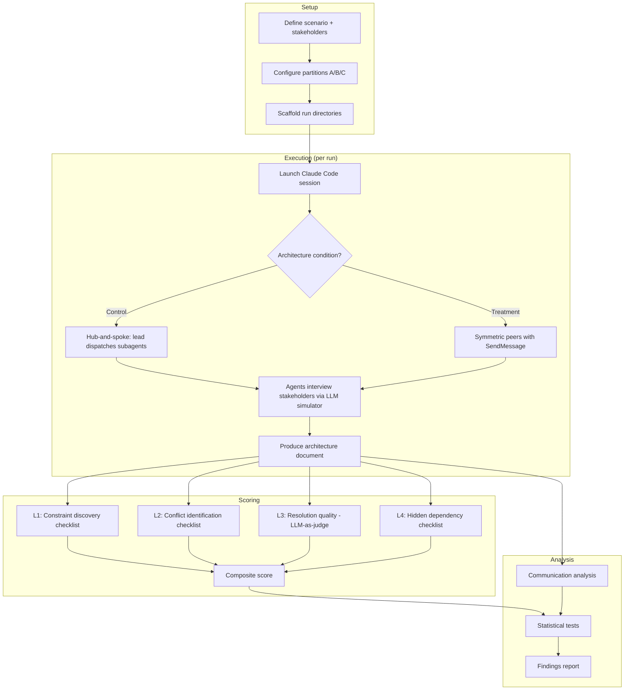
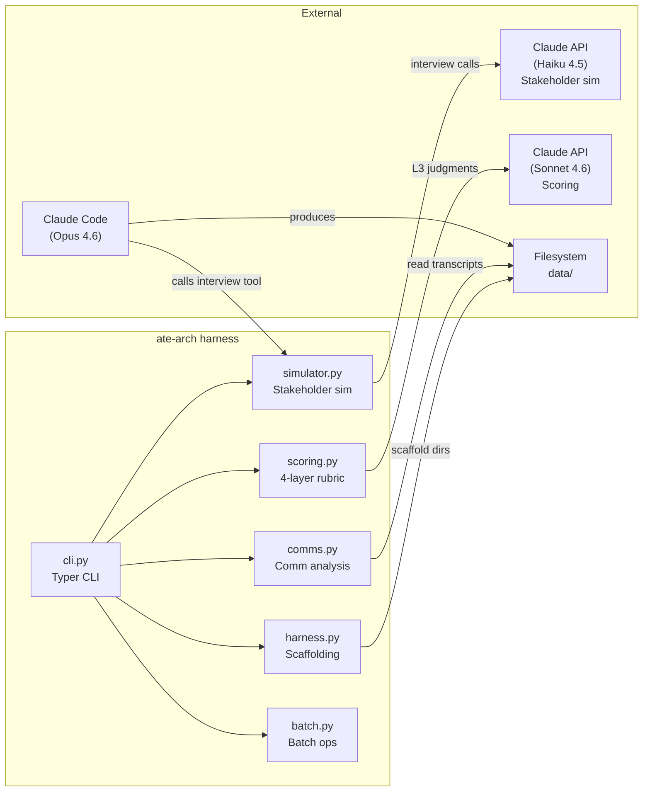
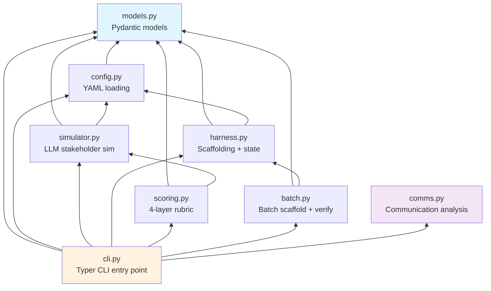
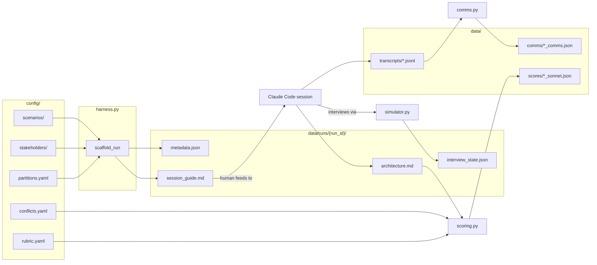
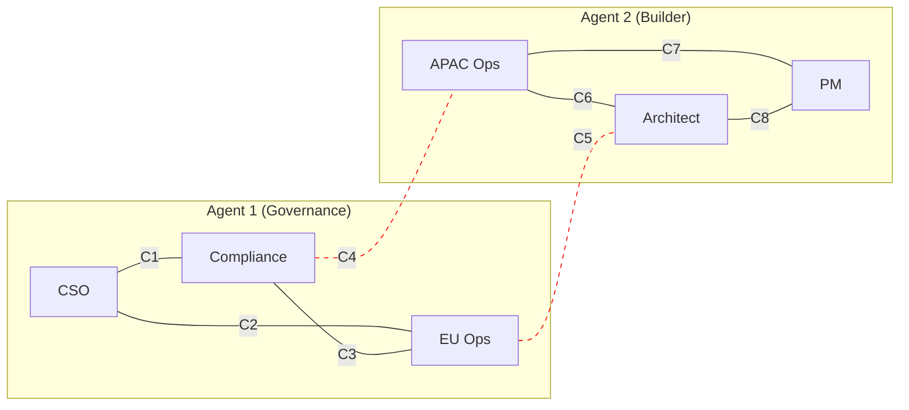
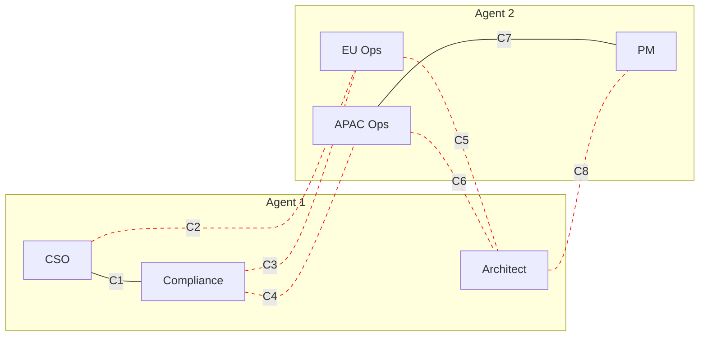

# Architecture

System architecture for the ate-arch experiment harness.

## 1. Experiment Protocol Flow

End-to-end flow from experiment setup to statistical analysis.



## 2. System Boundaries

External systems and their interfaces with the ate-arch harness.



## 3. Module Dependency Graph

Internal import dependencies between Python modules.



`models.py` is the foundation (zero internal dependencies). `cli.py` is the
hub (imports all modules). `comms.py` is standalone (no internal dependencies).

## 4. Data Flow

How data moves through the system during a complete experiment run.



## 5. Experimental Design: 2x2 Matrix

The experiment crosses 2 architecture conditions with 2 partition conditions
(Partition B was designed but not executed).

```
                    Partition A              Partition C
                    (25% cross)              (75% cross)
                ┌─────────────────┬─────────────────────┐
                │                 │                     │
   Control      │  Control-A      │  Control-C          │
   (hub-spoke)  │  Most conflicts │  Most conflicts     │
                │  within-agent   │  cross-agent        │
                │  Mean: 0.81     │  Mean: 0.84         │
                ├─────────────────┼─────────────────────┤
                │                 │                     │
   Treatment    │  Treatment-A    │  Treatment-C        │
   (peers)      │  Peers can talk │  Peers NEED to talk │
                │  but don't need │  for most conflicts │
                │  Mean: 0.88     │  Mean: 0.91         │
                └─────────────────┴─────────────────────┘
```

### Partition A: 6 within, 2 cross



### Partition C: 2 within, 6 cross



Solid lines = within-partition conflicts (resolvable by a single agent).
Dashed red lines = cross-partition conflicts (require cross-agent information).
