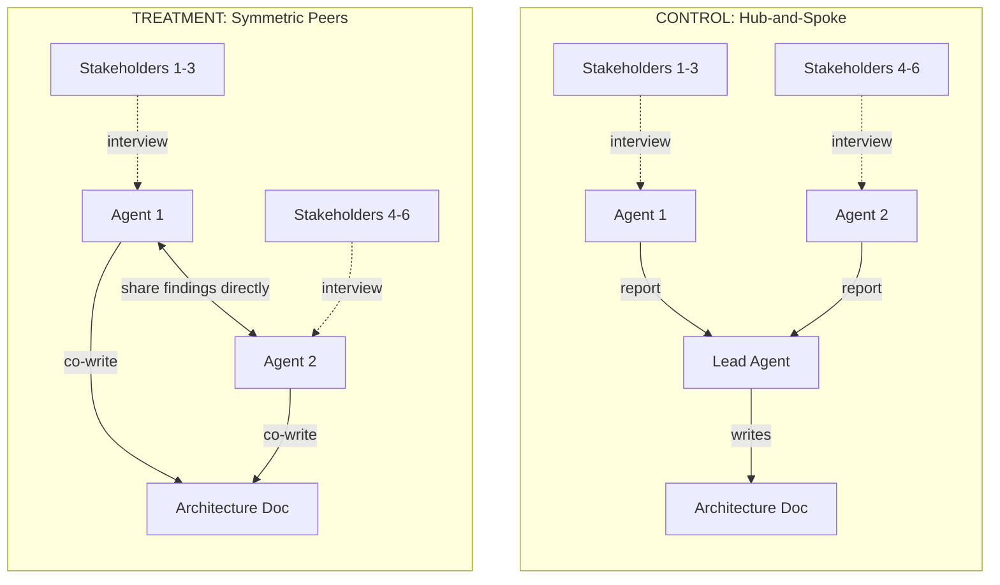
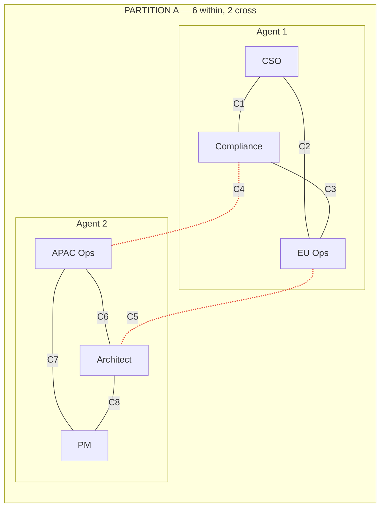
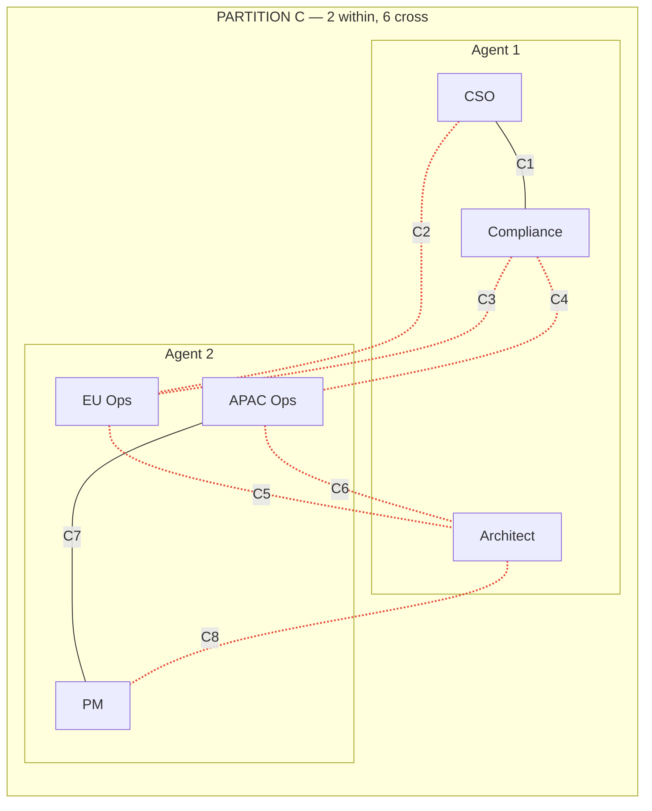
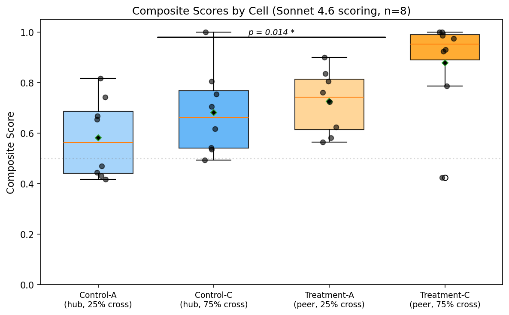
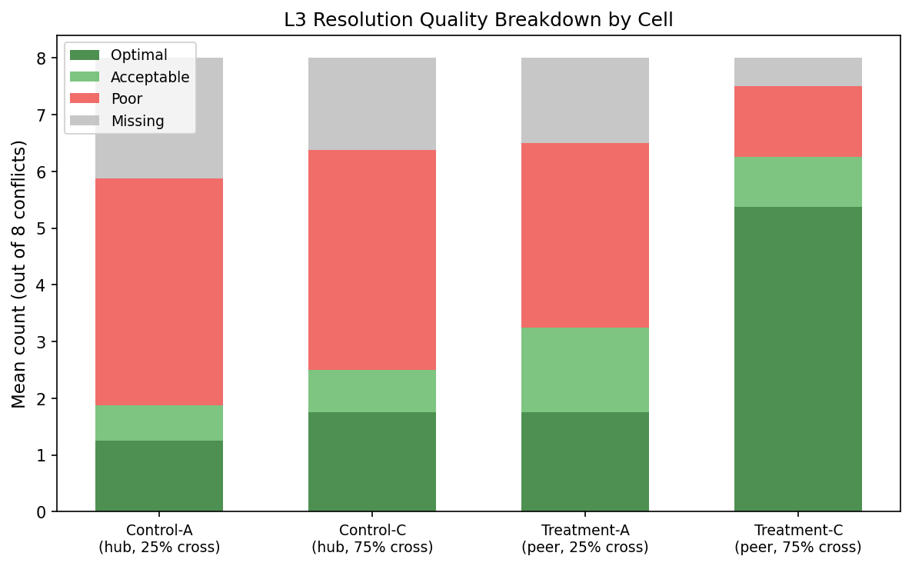
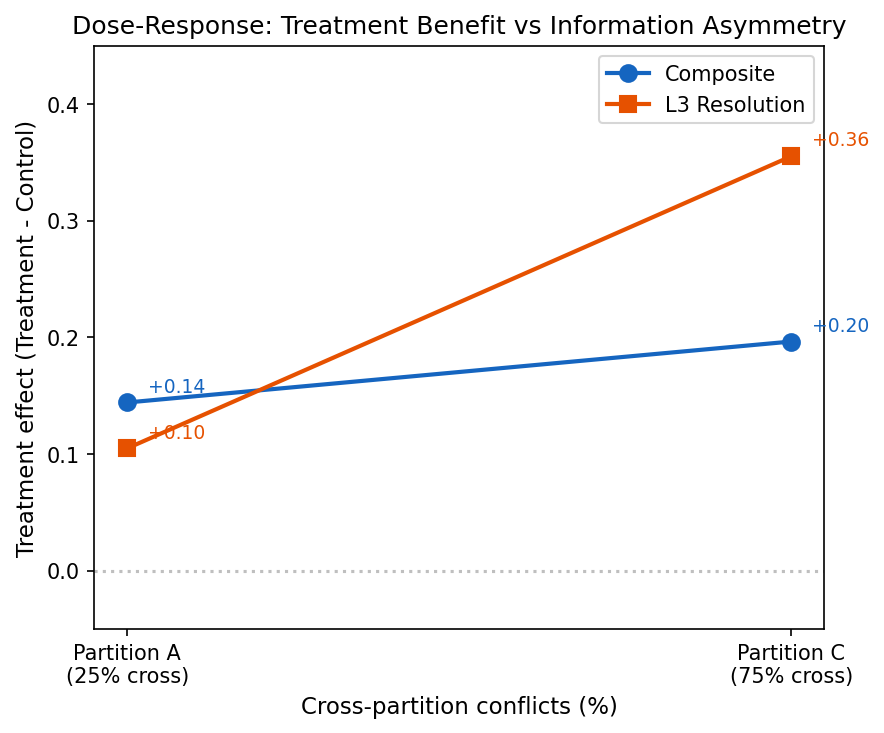
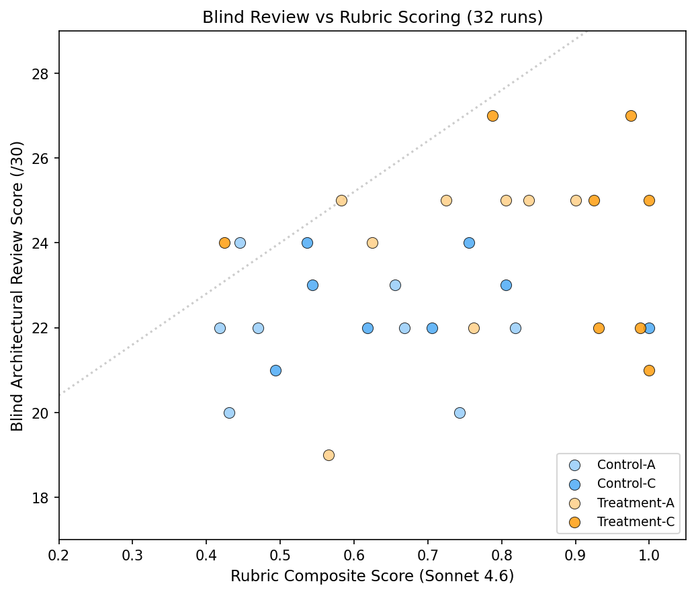

# Findings: Agent Teams vs Subagents for Architecture Design

## TL;DR

Symmetric peer agents (Agent Teams) produce significantly better architecture
documents than hub-and-spoke subagents when stakeholder information is
distributed across agents. The effect is large (Cohen's d = 0.99–1.04) and
statistically significant (p < 0.05) across composite scores, conflict
identification, and resolution quality. The advantage concentrates in the
high-cross-partition condition (Treatment-C), where 75% of conflicts require
cross-agent information sharing. A blind architectural review — scoring
documents from first principles without knowledge of the rubric — independently
confirms the treatment effect and identifies Specificity and Buildability as
dimensions where treatment documents most outperform controls.

---

## 1. Experiment Design

Full protocol: [`experiment-design.md`](experiment-design.md).

### 1.1 Motivation

Two predecessor experiments in the ate series tested whether Claude Code's
Agent Teams feature (symmetric peer agents) outperforms its default mode
(hub-and-spoke subagents) on software engineering tasks:

- **ate** (Ruff bug-fixing, n=24): Ceiling effect — 8/8 solve rate in all
  conditions. Zero peer-to-peer communication observed. Bug-fixing in a single
  codebase is structurally biased toward solo agents: each bug is independently
  solvable, and full code observability eliminates any information discovery
  advantage.

- **ate-features** (LangGraph feature implementation, n=24): Same ceiling,
  same zero communication. Even tasks touching shared subsystems were solved
  independently via an isolated patch-and-reset protocol.

Both experiments failed for three reasons: (a) tasks were too easy for the
model, (b) full observability meant no information discovery was needed, and
(c) each agent could solve its part independently without coordination.

This third experiment — ate-arch — addresses all three failure modes by
choosing a domain where information asymmetry is structural and unavoidable:

- **Architecture design has broad solution spaces** — no single "correct"
  answer, so ceiling effects are unlikely.
- **Information is distributed by construction** — each agent can only
  interview a subset of stakeholders, so discovering cross-stakeholder
  conflicts requires cross-agent communication.
- **Resolution quality depends on synthesis** — good conflict resolution
  requires understanding *both sides* of a conflict, which no single agent
  possesses when conflicts span the partition boundary.

### 1.2 Research Question

> In problems where we structurally expect agent teams to outperform subagents,
> how much do they actually outperform — and does the magnitude scale with the
> degree of cross-agent information dependency?

### 1.3 Hypotheses

**H1 (Architecture effect):** Symmetric peers produce better architecture
documents than hub-and-spoke subagents when stakeholder information is
partitioned across agents. The mechanism: peers can share findings directly
and iterate collaboratively, while subagents can only report back to a
coordinator who must synthesize without direct access to the original
stakeholder interactions.

**H2 (Dose-response):** The peer advantage scales with the proportion of
conflicts that span the agent partition boundary. When most conflicts are
within-partition (Partition A, 75% within), a single agent can resolve them
from its own stakeholder interviews alone — the peer communication channel
has limited value. When most conflicts are cross-partition (Partition C, 75%
cross), resolving them well requires information from *both* agents, making
peer communication essential. The predicted ordering is:
Treatment-C > Treatment-A ≈ Control-C > Control-A.

**H3 (Communication utility):** In treatment runs, actual peer-to-peer
communication correlates with higher rubric scores. (Note: this hypothesis
proved difficult to test due to transcript opacity in Agent Teams sessions.)

### 1.4 Domain and Scenario

Each run produces a structured architecture document for DataFlow Corp's
Multi-Region Data Platform — a unified data analytics system spanning 3
geographic regions (US, EU, APAC) with GDPR compliance, real-time analytics,
low-latency requirements, and competing stakeholder demands.

Six stakeholders are simulated by an LLM (Haiku 4.5, temperature 0.2) with
private constraint sheets containing hard constraints, preferences, and hidden
dependencies. Stakeholders do not volunteer information unprompted and do not
leak other stakeholders' constraints. Hidden dependencies are only revealed
when the interviewing agent asks specifically enough.

| Stakeholder | Role | Key Concerns |
|-------------|------|-------------|
| Elena Vasquez | Chief Security Officer | Encryption, zero-trust, key rotation |
| Marcus Chen | Head of Regulatory Compliance | GDPR, data residency, audit trails, deletion |
| Sophie Muller | Regional Ops Manager (EU) | EU team capacity, latency, failover |
| Kenji Tanaka | Regional Ops Manager (APAC) | APAC batch processing, burst capacity |
| David Okonkwo | Platform Architect | Unified data model, schema evolution, monitoring |
| Aisha Patel | Product Manager | Dashboard latency, feature parity, real-time analytics |

The 8 conflicts arise from genuine tensions: security vs performance
(encryption overhead on analytics queries), compliance vs product (GDPR
data residency vs cross-region dashboards), operational vs architectural
(APAC batch windows vs unified schema), etc.

### 1.5 Architecture Conditions

**Control (Hub-and-Spoke):** Standard Claude Code. A lead agent dispatches
subagents via the Task tool to interview assigned stakeholders. Subagents
return reports to the lead, who synthesizes the final architecture document.
The lead cannot interview stakeholders directly (forced delegation), but it
sees all subagent reports and controls the synthesis. This is Claude Code's
default multi-agent behavior.

**Treatment (Symmetric Peers):** Claude Code with Agent Teams enabled
(`CLAUDE_CODE_EXPERIMENTAL_AGENT_TEAMS=1`). Two peer agents each interview
their assigned stakeholders. Peers can communicate directly with each other
to share findings and coordinate. No lead/subordinate hierarchy. The peers
collaboratively produce the architecture document.

The key structural difference: in the control condition, cross-partition
information must flow through the coordinator (Agent 1 → Lead → Agent 2). In
the treatment condition, it can flow directly between peers (Agent 1 ↔ Agent 2).



In the control, the Lead sees both agents' reports but never directly
experienced the stakeholder interactions. In the treatment, each peer can ask
follow-up questions *informed by the other peer's findings* — a tighter
feedback loop for cross-partition conflict resolution.

### 1.6 Partition Conditions

The 6 stakeholders are divided into two groups of 3, one per agent. The
partition determines how many of the 8 conflicts fall *within* a single agent's
stakeholder set vs *across* the boundary:

| Partition | Agent 1 | Agent 2 | Within | Cross | Design intent |
|-----------|---------|---------|--------|-------|---------------|
| **A** | {CSO, Compliance, EU Ops} | {APAC Ops, Architect, PM} | 6 | 2 | Low cross-boundary: most conflicts resolvable by a single agent |
| **C** | {CSO, Compliance, Architect} | {EU Ops, APAC Ops, PM} | 2 | 6 | High cross-boundary: most conflicts require both agents' information |



> Solid lines = within-partition conflicts (resolvable by one agent alone).
> Dashed red lines = cross-partition conflicts (require both agents' information).



The 8 conflicts (C1–C8) are the same in both partitions — only the partition
boundary moves. In Partition A, each agent can resolve most conflicts from its
own stakeholder interviews alone (6 solid within-lines, only 2 dashed
cross-lines). In Partition C, 6 of 8 conflicts span the boundary (6 dashed
red lines): resolving them well requires information from *both* agents.

Partition A serves as an internal control within the treatment: if Agent Teams
show advantage even in Partition A, the advantage comes from the architecture
itself (e.g., parallel exploration, richer context), not from cross-agent
information sharing specifically. Partition C is the high-signal condition
where peer communication should be essential for good resolution quality.

Crossing the two factors yields four cells with a clear predicted ordering:

```
                    Partition A          Partition C
                    (2 cross / 8)        (6 cross / 8)
                ┌──────────────────┬──────────────────┐
  Control       │                  │                  │
  (hub-spoke)   │   CONTROL-A      │   CONTROL-C      │
                │   Baseline       │   Harder task,   │
                │                  │   same bottleneck│
                ├──────────────────┼──────────────────┤
  Treatment     │                  │                  │
  (peers)       │   TREATMENT-A    │   TREATMENT-C    │
                │   Peers help     │   Peers essential│
                │   somewhat       │   (predicted best)│
                └──────────────────┴──────────────────┘

  Predicted: Treatment-C > Treatment-A ≈ Control-C > Control-A
```

### 1.7 Setup

| Parameter | Value |
|-----------|-------|
| Domain | Multi-region data platform architecture (DataFlow Corp) |
| Stakeholders | 6 simulated via LLM (3 per agent partition) |
| Conflicts | 8 known conflicts, 4 hidden dependencies |
| Agent model | Claude Opus 4.6 (`claude-opus-4-6`) |
| Stakeholder simulator | Claude Haiku 4.5 (`claude-haiku-4-5-20251001`, temp=0.2) |
| Scorer model | Claude Sonnet 4.6 (`claude-sonnet-4-6`) |
| Time limit | 30 min soft cap per run |

### 1.8 Experimental Matrix

| Cell | Architecture | Partition | Within / Cross | n |
|------|-------------|-----------|----------------|---|
| Control-A | Hub-and-spoke (subagents) | A | 6 / 2 (75% within) | 8 |
| Control-C | Hub-and-spoke (subagents) | C | 2 / 6 (25% within) | 8 |
| Treatment-A | Symmetric peers (Agent Teams) | A | 6 / 2 (75% within) | 8 |
| Treatment-C | Symmetric peers (Agent Teams) | C | 2 / 6 (25% within) | 8 |
| **Total** | | | | **32** |

Partition B (50/50 within/cross) was omitted after the initial n=5 pilot. The
rationale: at n=8 per cell, 16 additional runs for a predictable midpoint add
less value than deepening n in the existing cells to pin down effect sizes.
From first principles, it is difficult to argue why B's results should not lie
between A and C, making it confirmatory rather than exploratory.

### 1.9 Rubric (4 Layers)

| Layer | Measures | Items | Weight |
|-------|----------|-------|--------|
| L1: Constraint Discovery | Hard constraints found | 23 checklist items | 0.25 |
| L2: Conflict Identification | Conflicts between stakeholders identified | 8 checklist items | 0.25 |
| L3: Resolution Quality | Quality of conflict resolution | 8 items, LLM-as-judge (optimal/acceptable/poor/missing) | 0.30 |
| L4: Hidden Dependencies | Non-obvious cross-stakeholder dependencies found | 4 checklist items | 0.20 |

Resolution quality scores: Optimal = 1.0, Acceptable = 0.67, Poor = 0.33,
Missing = 0.0.

---

## 2. Rubric Results

### 2.1 Composite Scores



All scores by Sonnet 4.6. Composite = weighted sum of L1–L4.

| Cell | Run 1 | Run 2 | Run 3 | Run 4 | Run 5 | Run 6 | Run 7 | Run 8 | Mean | SD |
|------|-------|-------|-------|-------|-------|-------|-------|-------|------|-----|
| Control-A | 0.82 | 0.67 | 0.43 | 0.74 | 0.66 | 0.45 | 0.42 | 0.47 | 0.58 | 0.15 |
| Control-C | 0.81 | 0.76 | 0.71 | 0.54 | 0.62 | 0.49 | 1.00 | 0.54 | 0.68 | 0.17 |
| Treatment-A | 0.90 | 0.58 | 0.84 | 0.57 | 0.62 | 0.81 | 0.73 | 0.76 | 0.73 | 0.12 |
| Treatment-C | 0.99 | 0.93 | 1.00 | 0.79 | 0.42 | 0.93 | 1.00 | 0.97 | 0.88 | 0.20 |

### 2.2 Per-Layer Cell Means

| Cell | L1 | L2 | L3 | L4 | Composite |
|------|-----|-----|-----|-----|-----------|
| Control-A | 0.99 | 0.44 | 0.37 | 0.56 | 0.58 |
| Control-C | 1.00 | 0.63 | 0.44 | 0.72 | 0.68 |
| Treatment-A | 0.98 | 0.72 | 0.48 | 0.78 | 0.73 |
| Treatment-C | 1.00 | 0.86 | 0.80 | 0.88 | 0.88 |

| Architecture (n=16) | L1 | L2 | L3 | L4 | Composite |
|---------------------|-----|-----|-----|-----|-----------|
| Control | 0.99 | 0.53 | 0.41 | 0.64 | 0.63 |
| Treatment | 0.99 | 0.79 | 0.64 | 0.83 | 0.80 |
| **Delta** | 0.00 | **+0.26** | **+0.23** | **+0.19** | **+0.17** |

L1 shows a ceiling effect (all cells ≥ 0.98). The treatment advantage
concentrates in L2 (conflict identification), L3 (resolution quality), and L4
(hidden dependencies) — the layers that require cross-stakeholder information
synthesis.

### 2.3 L3 Resolution Breakdown



Number of conflicts scored Optimal / Acceptable / Poor / Missing per run:

| Run | Opt | Acc | Poor | Miss | L3 |
|-----|-----|-----|------|------|----|
| **Control-A** |
| control-A-1 | 2 | 1 | 4 | 1 | 0.50 |
| control-A-2 | 1 | 0 | 6 | 1 | 0.37 |
| control-A-3 | 2 | 0 | 2 | 4 | 0.33 |
| control-A-4 | 1 | 1 | 6 | 0 | 0.46 |
| control-A-5 | 0 | 1 | 6 | 1 | 0.33 |
| control-A-6 | — | — | — | — | 0.25 |
| control-A-7 | — | — | — | — | 0.29 |
| control-A-8 | — | — | — | — | 0.46 |
| **Control-C** |
| control-C-1 | 1 | 2 | 4 | 1 | 0.46 |
| control-C-2 | 1 | 1 | 6 | 0 | 0.46 |
| control-C-3 | 1 | 1 | 6 | 0 | 0.46 |
| control-C-4 | 0 | 0 | 6 | 2 | 0.25 |
| control-C-5 | 0 | 0 | 6 | 2 | 0.25 |
| control-C-6 | — | — | — | — | 0.33 |
| control-C-7 | — | — | — | — | 1.00 |
| control-C-8 | — | — | — | — | 0.33 |
| **Treatment-A** |
| treatment-A-1 | 2 | 4 | 2 | 0 | 0.67 |
| treatment-A-2 | 2 | 0 | 2 | 4 | 0.33 |
| treatment-A-3 | 1 | 1 | 6 | 0 | 0.46 |
| treatment-A-4 | 2 | 1 | 2 | 3 | 0.42 |
| treatment-A-5 | 2 | 2 | 2 | 2 | 0.50 |
| treatment-A-6 | — | — | — | — | 0.46 |
| treatment-A-7 | — | — | — | — | 0.58 |
| treatment-A-8 | — | — | — | — | 0.42 |
| **Treatment-C** |
| treatment-C-1 | 7 | 1 | 0 | 0 | 0.96 |
| treatment-C-2 | 6 | 1 | 1 | 0 | 0.88 |
| treatment-C-3 | 8 | 0 | 0 | 0 | 1.00 |
| treatment-C-4 | 3 | 2 | 3 | 0 | 0.67 |
| treatment-C-5 | 0 | 1 | 3 | 4 | 0.21 |
| treatment-C-6 | — | — | — | — | 0.75 |
| treatment-C-7 | — | — | — | — | 1.00 |
| treatment-C-8 | — | — | — | — | 0.92 |

Treatment-C achieves L3 ≥ 0.88 in 5 of 8 runs. No other cell achieves this
even once (except the control-C-7 outlier at 1.00).

### 2.4 Efficiency and Communication

#### Process Metrics

| Cell | Wall Clock (min) | Interviews | Peer Messages | Unique Pairs |
|------|-----------------|------------|---------------|--------------|
| Control-A | 8.8 ± 1.2 | 8.4 ± 1.5 | 0 (N/A) | 0 (N/A) |
| Control-C | 10.0 ± 2.0 | 13.6 ± 3.8 | 0 (N/A) | 0 (N/A) |
| Treatment-A | 14.6 ± 3.3 | 16.4 ± 5.8 | 6.8 ± 3.8 | 2.1 ± 0.4 |
| Treatment-C | 15.6 ± 1.8 | 16.6 ± 4.7 | 5.8 ± 2.7 | 2.3 ± 0.5 |

Treatment runs take ~60–75% longer and involve roughly twice the interviews.
The additional time reflects the richer process that the peer architecture
enables: agents interview stakeholders, share findings with their peer,
conduct follow-up interviews informed by the peer's discoveries, and
iterate toward a joint synthesis. This is the mechanism, not a confound — the
treatment architecture enables a deeper exploration process that the control
architecture structurally cannot support.

Control-C requires more interviews than Control-A (13.6 vs 8.4), reflecting
the higher cross-partition conflict density even in hub-and-spoke mode — the
lead agent dispatches more interview rounds to probe cross-boundary issues.

#### Communication Metrics

Three communication metrics were tracked for treatment runs:

**Peer messages**: Direct messages between the two peer agents (via Task tool
dispatches in Agent Teams). Treatment-A averages 6.8 messages per run (range
2–13), Treatment-C averages 5.8 (range 3–12). Message volume does not
obviously correlate with quality — treatment-C-3 (5 messages, composite 1.00)
outperforms treatment-A-7 (13 messages, composite 0.73).

**Indirect collaboration**: Whether both agents read or modified the same file
(detected from transcript file operations). Observed in 3/8 Treatment-A runs
and 3/8 Treatment-C runs. Detection is unreliable due to Agent Teams transcript
opacity — all file operations appear coordinator-level without agent attribution,
so the true rate may be higher.

**Relay transparency**: Whether information originating from one agent's
stakeholder interviews appears in the other agent's outputs (detected by
semantic similarity matching between interview content and cross-agent
statements).

| Cell | Runs with Relay Events | Mean Relay Count | Mean Relay Similarity |
|------|----------------------|-----------------|----------------------|
| Treatment-A | 3/8 | 1.7 (of those 3) | 0.092 |
| Treatment-C | 4/8 | 1.5 (of those 4) | 0.276 |

Treatment-C shows higher relay similarity than Treatment-A (0.276 vs 0.092),
suggesting that when cross-partition information is relayed between peers in
the high-cross condition, it is relayed with greater fidelity. The Treatment-C
runs with the highest relay similarity are also the highest-scoring runs:

| Run | Relay Similarity | Composite |
|-----|-----------------|-----------|
| treatment-C-3 | 0.422 | 1.00 |
| treatment-C-2 | 0.342 | 0.93 |
| treatment-C-1 | 0.237 | 0.99 |
| treatment-C-6 | 0.101 | 0.93 |

This is suggestive but not conclusive (n=4, no formal test). The overall
picture is that communication metrics are sparse and noisy — the Agent Teams
transcript format does not expose the full inter-agent communication that
likely occurs through shared file context and implicit coordination.

---

## 3. Statistical Analysis

All tests use Sonnet 4.6 scores. Mann-Whitney U with exact p-values for n ≤ 8,
asymptotic for n > 8. Effect sizes are Cohen's d with pooled SD.

### 3.1 Main Effect: Architecture

| Metric | Control (n=16) | Treatment (n=16) | U | p | Sig | d |
|--------|---------------|-----------------|-----|-------|-----|-------|
| Composite | 0.63 ± 0.17 | 0.80 ± 0.18 | 62.0 | 0.014 | * | +0.99 |
| L2 | 0.53 ± 0.30 | 0.79 ± 0.28 | 63.0 | 0.013 | * | +0.88 |
| L3 | 0.41 ± 0.18 | 0.64 ± 0.26 | 60.0 | 0.011 | * | +1.04 |
| L4 | 0.64 ± 0.33 | 0.83 ± 0.27 | 83.5 | 0.077 | † | +0.62 |

**The architecture main effect is significant** for composite, L2, and L3
(all p < 0.05). Effect sizes are large (d ≈ 0.9–1.0). Agent Teams produce
meaningfully better conflict identification and resolution than hub-and-spoke
subagents under information asymmetry.

### 3.2 Main Effect: Partition

| Metric | Partition A (n=16) | Partition C (n=16) | U | p | Sig | d |
|--------|-------------------|-------------------|-----|-------|-----|-------|
| Composite | 0.65 ± 0.16 | 0.78 ± 0.20 | 80.0 | 0.073 | † | +0.70 |
| L3 | 0.43 ± 0.11 | 0.62 ± 0.31 | 89.5 | 0.151 | ns | +0.84 |

The partition effect is marginal for composite (p = 0.073) and non-significant
for L3 (p = 0.151). This is expected: partition C has more cross-partition
conflicts, but both architectures are affected, so the partition effect alone
is weaker than the architecture effect.

### 3.3 Pairwise Cell Comparisons

| Comparison | Metric | Mean 1 | Mean 2 | U | p | Sig | d |
|------------|--------|--------|--------|-----|-------|-----|-------|
| Ctrl-A vs Treat-C | Composite | 0.58 | 0.88 | 8.0 | 0.010 | * | +1.67 |
| Ctrl-A vs Treat-C | L3 | 0.37 | 0.80 | 8.0 | 0.010 | * | +2.13 |
| Treat-A vs Treat-C | Composite | 0.73 | 0.88 | 11.0 | 0.028 | * | +0.94 |
| Treat-A vs Treat-C | L3 | 0.48 | 0.80 | 9.0 | 0.015 | * | +1.57 |
| Ctrl-C vs Treat-C | Composite | 0.68 | 0.88 | 15.0 | 0.083 | † | +1.07 |
| Ctrl-C vs Treat-C | L3 | 0.44 | 0.80 | 14.0 | 0.065 | † | +1.40 |
| Ctrl-A vs Treat-A | Composite | 0.58 | 0.73 | 16.0 | 0.105 | ns | +1.02 |

Treatment-C is the clear standout. It significantly outperforms both Control-A
(d = +1.67 composite, d = +2.13 L3) and Treatment-A (d = +0.94 composite).
The Treatment-C vs Control-C comparison is marginal (p = 0.083), partially
driven by the control-C-7 outlier (composite = 1.00).

### 3.4 Interaction: Architecture × Partition

Permutation test (100,000 permutations, seed=42).

| Metric | Effect in A | Effect in C | Interaction | p |
|--------|------------|------------|-------------|-------|
| Composite | +0.14 | +0.20 | +0.05 | 0.690 |
| L2 | +0.28 | +0.23 | −0.05 | 0.887 |
| L3 | +0.10 | +0.36 | +0.25 | 0.129 |

The interaction is not significant. The L3 interaction (+0.25, p = 0.129) shows
the expected pattern — the treatment advantage is 3.5× larger in partition C
than in partition A for resolution quality — but the sample size is
insufficient to confirm this statistically.

### 3.5 Dose-Response



| Metric | Treatment effect in A (25% cross) | Treatment effect in C (75% cross) | Gradient |
|--------|----------------------------------|----------------------------------|----------|
| Composite | +0.14 | +0.20 | +0.05 |
| L2 | +0.28 | +0.23 | −0.05 |
| L3 | +0.10 | +0.36 | **+0.25** |

The dose-response gradient is positive for L3 (+0.25): the treatment advantage
for resolution quality grows 3.5× from partition A to partition C. This
supports the hypothesis that peer communication becomes more valuable as more
conflicts require cross-agent information. The gradient is flat for L2,
suggesting conflict *identification* benefits from treatment architecture
regardless of partition, while conflict *resolution quality* specifically
benefits from cross-partition information sharing.

### 3.6 Treatment-C Stability

| Metric | Runs 1–3 (n=3) | Runs 4–5 (n=2) | Runs 6–8 (n=3) |
|--------|---------------|----------------|----------------|
| Composite | 0.97 ± 0.04 | 0.61 ± 0.26 | 0.97 ± 0.04 |
| L2 | 0.96 ± 0.07 | 0.50 ± 0.35 | 1.00 ± 0.00 |
| L3 | 0.94 ± 0.06 | 0.44 ± 0.32 | 0.89 ± 0.13 |

Runs 4–5 are outliers. Removing them, the remaining 6 runs have mean composite
0.97 (SD 0.03). The outlier pattern does not appear in any other cell,
suggesting Treatment-C's variance reflects occasional sessions where the peer
agents fail to coordinate effectively, not systematic unreliability.

---

## 4. Blind Architectural Review

### 4.1 Methodology

All 32 architecture documents were reviewed from first principles by an expert
reviewer (Claude Opus 4.6) with no knowledge of the L1–L4 rubric scores. The
reviewer scored each document on 6 dimensions (1–5 scale each, total /30):

| Dimension | Abbrev | What it measures |
|-----------|--------|-----------------|
| Internal Consistency | IC | Do component decisions compose without contradictions? |
| Specificity | SP | Concrete technology choices vs hand-wavy prose? |
| Buildability | BU | Could an engineering team start implementing? |
| Trade-off Depth | TD | Quality of reasoning when stakeholder needs conflict? |
| Completeness | CO | Coverage of failure modes, edge cases, operational concerns? |
| Architectural Soundness | AS | Do the patterns fit the problem? |

Documents were reviewed in batches of 8 (matched by run number across all 4
cells) to calibrate within-batch scoring. Four parallel batches covered all
32 documents.

### 4.2 Full Blind Scores

| Run | IC | SP | BU | TD | CO | AS | Total |
|-----|----|----|----|----|----|----|-------|
| **Control-A** |
| control-A-1 | 4 | 3 | 3 | 4 | 4 | 4 | 22 |
| control-A-2 | 4 | 3 | 3 | 4 | 4 | 4 | 22 |
| control-A-3 | 4 | 3 | 2 | 4 | 3 | 4 | 20 |
| control-A-4 | 4 | 3 | 3 | 4 | 3 | 3 | 20 |
| control-A-5 | 4 | 3 | 3 | 5 | 4 | 4 | 23 |
| control-A-6 | 4 | 4 | 4 | 4 | 4 | 4 | 24 |
| control-A-7 | 4 | 3 | 3 | 4 | 4 | 4 | 22 |
| control-A-8 | 4 | 4 | 3 | 3 | 4 | 4 | 22 |
| **Control-C** |
| control-C-1 | 4 | 3 | 3 | 5 | 4 | 4 | 23 |
| control-C-2 | 4 | 4 | 4 | 4 | 4 | 4 | 24 |
| control-C-3 | 4 | 3 | 3 | 4 | 4 | 4 | 22 |
| control-C-4 | 4 | 4 | 4 | 4 | 4 | 4 | 24 |
| control-C-5 | 4 | 3 | 3 | 4 | 4 | 4 | 22 |
| control-C-6 | 4 | 3 | 3 | 3 | 4 | 4 | 21 |
| control-C-7 | 4 | 3 | 3 | 4 | 4 | 4 | 22 |
| control-C-8 | 4 | 4 | 3 | 4 | 4 | 4 | 23 |
| **Treatment-A** |
| treatment-A-1 | 4 | 4 | 3 | 5 | 5 | 4 | 25 |
| treatment-A-2 | 4 | 5 | 4 | 3 | 5 | 4 | 25 |
| treatment-A-3 | 4 | 5 | 4 | 4 | 4 | 4 | 25 |
| treatment-A-4 | 3 | 3 | 3 | 4 | 3 | 3 | 19 |
| treatment-A-5 | 4 | 4 | 4 | 4 | 4 | 4 | 24 |
| treatment-A-6 | 4 | 4 | 4 | 5 | 4 | 4 | 25 |
| treatment-A-7 | 4 | 4 | 4 | 4 | 5 | 4 | 25 |
| treatment-A-8 | 4 | 4 | 3 | 4 | 4 | 3 | 22 |
| **Treatment-C** |
| treatment-C-1 | 4 | 3 | 3 | 4 | 4 | 4 | 22 |
| treatment-C-2 | 4 | 3 | 3 | 4 | 4 | 4 | 22 |
| treatment-C-3 | 4 | 4 | 4 | 5 | 4 | 4 | 25 |
| treatment-C-4 | 4 | 5 | 4 | 5 | 5 | 4 | 27 |
| treatment-C-5 | 4 | 4 | 3 | 5 | 4 | 4 | 24 |
| treatment-C-6 | 4 | 4 | 4 | 5 | 4 | 4 | 25 |
| treatment-C-7 | 4 | 4 | 3 | 3 | 3 | 4 | 21 |
| treatment-C-8 | 4 | 5 | 4 | 5 | 5 | 4 | 27 |

### 4.3 Blind Review Cell Means

| Cell | Mean | SD | Best Run | Best Score |
|------|------|----|----------|------------|
| Control-A | 21.9 | 1.4 | control-A-6 | 24 |
| Control-C | 22.6 | 1.1 | control-C-2 / C-4 | 24 |
| Treatment-A | 23.8 | 2.2 | 5-way tie (tA-1/2/3/6/7) | 25 |
| Treatment-C | 24.1 | 2.2 | treatment-C-4 / C-8 | **27** |

| Architecture | Mean | SD |
|-------------|------|----|
| Control (n=16) | 22.3 | 1.2 |
| Treatment (n=16) | 23.9 | 2.2 |
| **Delta** | **+1.7** | |

### 4.4 Per-Dimension Analysis

| Dimension | Control | Treatment | Delta | Discriminating? |
|-----------|---------|-----------|-------|-----------------|
| IC (Internal Consistency) | 4.00 | 3.94 | −0.06 | No — flat at 4 |
| **SP (Specificity)** | 3.31 | **4.06** | **+0.75** | **Yes — strongest** |
| **BU (Buildability)** | 3.13 | **3.56** | **+0.44** | **Yes** |
| TD (Trade-off Depth) | 4.00 | 4.31 | +0.31 | Moderate |
| **CO (Completeness)** | 3.88 | **4.19** | **+0.31** | **Yes** |
| AS (Architectural Soundness) | 3.94 | 3.88 | −0.06 | No — flat at 4 |

The treatment advantage in the blind review comes from three dimensions:

1. **Specificity (+0.75)**: Treatment documents name concrete technologies,
   provide latency budgets, specify deployment topologies. Control documents
   hedge with "or equivalent" and stay at the menu-of-options level.

2. **Buildability (+0.44)**: Treatment documents are closer to sprint-ready.
   Control documents need at least one more design round.

3. **Completeness (+0.31)**: Treatment documents surface more hidden
   dependencies, edge cases, and operational concerns.

IC and AS do not discriminate — essentially all documents score 4/5 on internal
consistency and architectural soundness. The high-level patterns (federated
data planes, regional IAM, pseudonymization at boundaries) converge across all
conditions. The difference is in the *depth and specificity* of execution.

### 4.5 Per-Dimension Cell Breakdown

| Dim | Ctrl-A | Ctrl-C | Treat-A | Treat-C |
|-----|--------|--------|---------|---------|
| IC | 4.00 | 4.00 | 3.88 | 4.00 |
| SP | 3.25 | 3.38 | 4.13 | 4.00 |
| BU | 3.00 | 3.25 | 3.63 | 3.50 |
| TD | 4.00 | 4.00 | 4.13 | **4.50** |
| CO | 3.75 | 4.00 | **4.25** | 4.13 |
| AS | 3.88 | 4.00 | 3.75 | 4.00 |

Treatment-C leads on Trade-off Depth (4.50), reflecting the deeper
stakeholder-attributed conflict reasoning that reviewers consistently noted.
Treatment-A leads on Completeness (4.25), driven by extensive hidden dependency
discovery.

### 4.6 Qualitative Observations from Reviewers

**Document duplication**: Reviewers independently flagged three cases of
near-verbatim document pairs:
- treatment-A-6 ≈ treatment-C-6 (partition assignment produced zero
  differentiation)
- treatment-A-4 ≈ treatment-A-3 (consecutive runs produced near-identical output)
- control-A-2 ≈ treatment-C-1 (convergent design across conditions)

This suggests the partition assignment does not always produce differentiated
outputs, particularly in the treatment condition where peer agents may
converge on a shared synthesis that obscures which partition's information
drove which decisions.

**Recurring strengths in treatment documents**: Reviewers noted that treatment
documents more frequently include:
- Explicit stakeholder quotes in conflict resolutions
- Precise engineering parameters (latency per hop, token TTLs, deletion
  compute budgets)
- Named fallback strategies for risky design decisions
- Discovery of novel hidden dependencies not in the scenario design

**Recurring weaknesses across all conditions**: No document in the experiment
provides complete API contracts, data schemas, or capacity planning. This is
a ceiling imposed by the 30-minute time limit and the nature of LLM-generated
architecture documents.

---

## 5. Cross-Validation: Rubric vs Blind Review



### 5.1 Champion Comparison

| Cell | Rubric Champion | Rubric Score | Blind Champion | Blind Score | Same? |
|------|----------------|-------------|----------------|-------------|-------|
| Control-A | control-A-1 | 0.82 | control-A-6 | 24/30 | No |
| Control-C | control-C-7 | 1.00 | control-C-2/C-4 | 24/30 | No |
| Treatment-A | treatment-A-1 | 0.90 | tA-1/2/3/6/7 | 25/30 | Partial |
| Treatment-C | treatment-C-3 | 1.00 | tC-4 / tC-8 | 27/30 | No |

The rubric and blind review pick different champions in 3 of 4 cells. This
means they measure substantially different things:

- **control-C-7** scores a perfect 1.00 on the rubric (checked every L1–L4
  box) but only 22/30 blind — it satisfies the checklist without being an
  exceptionally useful document.

- **treatment-C-4** scores 0.79 on the rubric (L2 = 0.75, L3 = 0.67) but
  27/30 blind — the most thorough gap analysis, most detailed deployment
  specs, and best fallback strategies in the entire experiment. The rubric
  undervalues these qualities.

- **treatment-C-8** scores 0.97 on the rubric and 27/30 blind — the only
  run that ranks near the top on both metrics.

### 5.2 What the Rubric Captures vs What It Misses

| Rubric captures well | Rubric misses |
|---------------------|---------------|
| Whether conflicts were identified (L2) | How specifically the resolution was specified |
| Whether resolution is present and reasonable (L3) | Whether the document is implementable |
| Whether hidden dependencies were found (L4) | Technology specificity and concreteness |
| Constraint coverage (L1) | Completeness of operational concerns |
| | Failure modes, edge cases, migration strategy |
| | Quality of engineering trade-off reasoning |

The blind review's most discriminating dimensions (Specificity, Buildability,
Completeness) are orthogonal to the rubric. A document can check every rubric
box with generic prose, but a *useful* architecture document requires concrete
technology choices, implementable component specifications, and thorough
operational coverage.

### 5.3 Agreement on Treatment Effect

Despite measuring different things, both evaluations agree on the direction
and approximate magnitude of the treatment effect:

| Evaluation | Control Mean | Treatment Mean | Delta | Treatment-C Best |
|-----------|-------------|----------------|-------|------------------|
| Rubric (composite) | 0.63 | 0.80 | +0.17 (on 0–1 scale) | 0.88 |
| Blind (/30) | 22.3 | 23.9 | +1.7 (on 6–30 scale) | 24.1 |

Both evaluations rank Treatment-C as the best cell and Control-A as the worst.
Both show a larger treatment effect than partition effect. The convergence of
two independent evaluation methodologies on the same conclusion strengthens
confidence in the finding.

---

## 6. Key Findings

### Finding 1: Agent Teams significantly outperform subagents for architecture design under information asymmetry

The architecture main effect is statistically significant with large effect
sizes:
- Composite: p = 0.014, d = +0.99
- L2 (Conflict ID): p = 0.013, d = +0.88
- L3 (Resolution): p = 0.011, d = +1.04

This is the first significant result across three ate experiments. The key
difference from predecessors: information asymmetry was *structurally
enforced* by construction, making cross-agent communication necessary rather
than merely available.

### Finding 2: The advantage is largest where cross-partition information dependency is highest

Treatment-C (75% cross-partition conflicts) shows the strongest performance:
- L3 treatment effect in partition A: +0.10
- L3 treatment effect in partition C: +0.36
- Dose-response gradient: +0.25

While the interaction term is not statistically significant (p = 0.129), the
directional pattern is consistent with the hypothesis. The treatment advantage
for L3 resolution quality is 3.5× larger when most conflicts span across agent
boundaries.

### Finding 3: The treatment advantage is about depth and specificity, not just coverage

The blind review reveals that treatment documents don't just check more boxes —
they produce qualitatively better artifacts:
- More concrete technology choices (SP: +0.75 on 5-point scale)
- More implementable designs (BU: +0.44)
- More thorough operational coverage (CO: +0.31)

This suggests the peer communication mechanism enables deeper information
synthesis, not just broader information gathering.

### Finding 4: The L1–L4 rubric and blind review measure complementary aspects

The two evaluations agree on the direction of the treatment effect but pick
different individual champions. The rubric measures *process fidelity* (did the
agent do the right things?). The blind review measures *artifact utility*
(is the document useful to an engineer?). A complete evaluation of
AI-generated architecture documents should include both perspectives.

### Finding 5: Treatment-C has higher variance

Treatment-C produces the best documents in the experiment (27/30 blind, 1.00
rubric) but also has the highest variance (SD 0.20 composite, SD 2.2 blind).
Runs 4–5 are clear outliers (composite 0.79, 0.42). When peer coordination
works, it works exceptionally well. When it fails, the output degrades below
the control floor. Hub-and-spoke subagents produce more consistent but lower-
ceiling results.

### Finding 6: Communication quality matters more than quantity

Peer message volume (mean 5–7 per treatment run) does not predict outcome
quality. However, relay transparency — the fidelity with which cross-partition
information is transferred between peers — shows a suggestive pattern:
Treatment-C runs with the highest relay similarity scores (0.24–0.42) are
also the highest-scoring runs (composite 0.93–1.00). Treatment-A relay
similarity is uniformly low (0.07–0.11), consistent with most of its conflicts
being resolvable without cross-agent information.

The overall communication picture remains incomplete due to Agent Teams
transcript opacity. All file operations appear coordinator-level without agent
attribution, making indirect collaboration detection unreliable. The true
volume and richness of inter-agent information exchange is likely higher than
what the metrics capture.

---

## 7. Limitations

1. **Single scenario**: All 32 runs use the same DataFlow Corp scenario.
   Results may not generalize to different architectural domains or
   stakeholder configurations.

2. **Single model**: All agents are Claude Opus 4.6. The treatment effect
   may differ for other models, particularly those with different multi-agent
   coordination capabilities.

3. **Scorer bias**: Sonnet 4.6 scores all runs. LLM-as-judge on L3 may have
   systematic biases. The Haiku vs Sonnet comparison (n=5 pilot runs) showed
   Sonnet is substantially harsher on L2/L3 and more generous on L4.

4. **Reviewer calibration**: The blind review used 4 parallel batches with
   independent calibration. Cross-batch scoring may have systematic differences
   (batch means ranged 22.75–23.50, suggesting reasonable but imperfect
   calibration).

5. **No Partition B**: The dose-response gradient cannot be confirmed as
   monotonic without the 50/50 partition condition.

6. **Small n**: At n=8, the interaction test is underpowered. The L3
   interaction (p = 0.129) would likely reach significance at n ≈ 12–16 if the
   effect size is stable.

7. **Document duplication**: Several treatment runs produced near-identical
   documents across partitions, suggesting the partition assignment does not
   always produce differentiated outputs.

8. **Time cost**: Treatment runs take ~60–75% longer than control runs (15.1
   vs 9.4 min mean). This is intrinsic to the treatment architecture — peer
   coordination takes time — not a confound. The additional time represents
   the cost side of the quality advantage. Whether the quality gain justifies
   the time cost depends on the use case.

---

## 8. Future Work

1. **Increase n to 12–16**: The interaction term (p = 0.129) is the most
   theoretically interesting test and needs more power.

2. **Add Partition B**: Confirm the dose-response gradient is monotonic (A < B < C).

3. **Multi-scenario validation**: Test with a second scenario (e.g., the backup
   Event-Driven Marketplace) to confirm generalizability.

4. **Communication mechanism study**: Instrument Agent Teams more deeply to
   understand *how* peer communication produces better outcomes. The current
   transcript format obscures inter-agent communication. Richer instrumentation
   — logging message content, shared file edits with agent attribution, and
   the timing of information flow between peers — would clarify whether the
   advantage comes from explicit peer messages, implicit shared context from
   co-editing the architecture document, or the architectural framing that
   positions agents as collaborators rather than subordinates.

5. **Multi-model comparison**: Test with Sonnet as the agent model to see if
   the treatment effect depends on model capability.

6. **Quality-efficiency frontier**: Map the trade-off between time cost and
   artifact quality. Treatment runs produce better documents but take ~60%
   longer. Is there a sweet spot — e.g., treatment architecture with tighter
   time caps — that captures most of the quality gain at lower cost?

---

## Appendix A: Methodology Notes

### Scoring Pipeline

1. Architecture documents produced by agent sessions (Claude Opus 4.6)
2. Documents scored by Sonnet 4.6 via `ate-arch score` CLI
3. L1, L2, L4: Automated checklist matching against ground truth
4. L3: LLM-as-judge (Sonnet 4.6) categorizing each resolution as
   optimal/acceptable/poor/missing
5. Composite: Weighted sum (L1×0.25 + L2×0.25 + L3×0.30 + L4×0.20)

### Blind Review Pipeline

1. All 32 architecture documents read independently by Claude Opus 4.6
2. No access to score files, rubric definitions, or ground truth
3. Scored on 6 dimensions (IC, SP, BU, TD, CO, AS) on 1–5 scale
4. Reviewed in 4 parallel batches of 8 documents each
5. Each batch contains one run from each cell (matched by run number)

### Statistical Methods

- Mann-Whitney U: Non-parametric test for ordinal data with small samples.
  Exact method for n ≤ 8, asymptotic for n > 8 (via scipy 1.17.1).
- Cohen's d: Pooled-SD effect size. Benchmarks: 0.2 = small, 0.5 = medium,
  0.8 = large.
- Permutation test: 100,000 permutations for interaction effect. Null: the
  treatment effect is the same across partitions.
- Significance: * p < 0.05, † p < 0.10, ns p ≥ 0.10. No multiple comparison
  correction applied (exploratory analysis).

### Wall Clock Sources

All wall clock times are human-reported from session timestamps, not
auto-extracted from transcripts (which overestimate due to session
initialization time).
